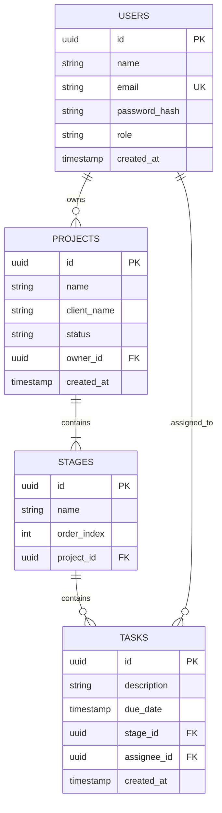

# Esquema do Banco de Dados (Database Schema)

O ArchFlow utiliza um banco de dados relacional PostgreSQL. Abaixo está o diagrama Entidade-Relacionamento (ER) das principais tabelas.

## Diagrama ER

## Descrição das Tabelas

### `users`
Armazena as informações de autenticação e perfil dos usuários (arquitetos, gestores, colaboradores).
*   **id:** Identificador único (UUID).
*   **email:** Usado para login (Unique).

### `projects`
Representa um projeto de arquitetura (ex: "Residência Lago Sul").
*   **owner_id:** Referência ao usuário que criou o projeto.
*   **status:** Estado geral do projeto (ex: EM_ANDAMENTO, CONCLUIDO).

### `stages`
Representa as colunas do Kanban (ex: "A Fazer", "Em Andamento").
*   **order_index:** Define a posição da coluna no quadro (0, 1, 2...).
*   **project_id:** Projeto ao qual esta etapa pertence.

### `tasks`
Representa as tarefas individuais dentro de uma etapa.
*   **stage_id:** A coluna onde a tarefa está atualmente.
*   **assignee_id:** Usuário responsável pela tarefa (opcional).
