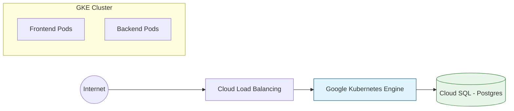

# Infraestrutura GCP (Google Cloud Platform)

A infraestrutura do ArchFlow é projetada para ser escalável e resiliente, utilizando serviços gerenciados do Google Cloud.

## Visão Geral da Infraestrutura



## Componentes

### 1. Google Kubernetes Engine (GKE)
O coração da execução da aplicação.
*   **Cluster:** Standard ou Autopilot.
*   **Pods:**
    *   `frontend`: Servidor Nginx servindo os arquivos estáticos do React.
    *   `backend`: Aplicação Spring Boot.
*   **Escalabilidade:** Horizontal Pod Autoscaling (HPA) configurado para escalar baseado em uso de CPU/Memória.

### 2. Cloud SQL (PostgreSQL)
Banco de dados gerenciado.
*   **Versão:** PostgreSQL 15.
*   **Backups:** Automáticos diários e Point-in-time recovery.
*   **Conexão:** Via Cloud SQL Proxy ou Private IP (VPC Peering) para segurança.

### 3. Cloud Load Balancing
Distribui o tráfego de entrada e gerencia certificados SSL (HTTPS).

### 4. Container Registry (Artifact Registry)
Armazena as imagens Docker do Frontend e Backend geradas pelo CI/CD.

## Infraestrutura como Código (IaC)

Toda a infraestrutura é provisionada via **Terraform**.

Exemplo de estrutura Terraform:
```hcl
resource "google_container_cluster" "primary" {
  name     = "archflow-cluster"
  location = "us-central1"
  
  # ... configurações do node pool
}

resource "google_sql_database_instance" "master" {
  name             = "archflow-db"
  database_version = "POSTGRES_15"
  region           = "us-central1"
}
```
