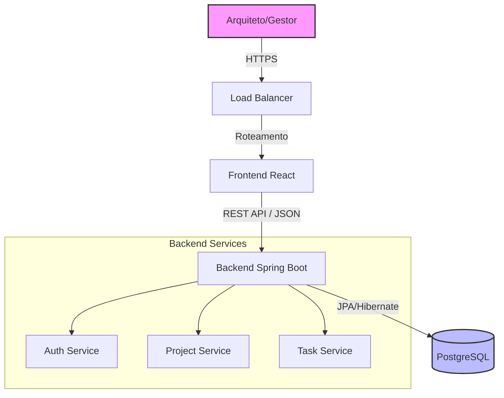

# Visão Geral do Sistema (System Overview)

## Arquitetura: Monólito Modular

O ArchFlow adota uma arquitetura de **Monólito Modular**. Isso significa que, embora o código seja implantado como uma única unidade (um arquivo `.jar` do Spring Boot), ele é estruturado internamente em módulos de domínio bem definidos.

### Por que Monólito Modular?
Para o estágio atual do projeto, microserviços adicionariam complexidade desnecessária (latência de rede, transações distribuídas, overhead de devops). O monólito modular permite:
1.  **Desenvolvimento Rápido:** Refatoração e mudanças de contrato são simples.
2.  **Deploy Simplificado:** Apenas um artefato para gerenciar.
3.  **Preparação para o Futuro:** Como os domínios são desacoplados via pacotes Java, extrair um módulo para um microserviço futuro é trivial.

## Diagrama de Fluxo de Dados

## Componentes Principais

### 1. Frontend (Client-Side)
*   **Tecnologia:** React.js com Vite.
*   **Responsabilidade:** Interface do usuário, gestão de estado local, chamadas à API.
*   **Hospedagem:** Servido via Nginx ou Bucket estático (em produção).

### 2. Backend (Server-Side)
*   **Tecnologia:** Java 17 com Spring Boot 3.
*   **Responsabilidade:** Regras de negócio, validação, persistência, segurança.
*   **API:** RESTful, documentada via Swagger/OpenAPI.

### 3. Banco de Dados
*   **Tecnologia:** PostgreSQL 15.
*   **Responsabilidade:** Armazenamento relacional persistente.
