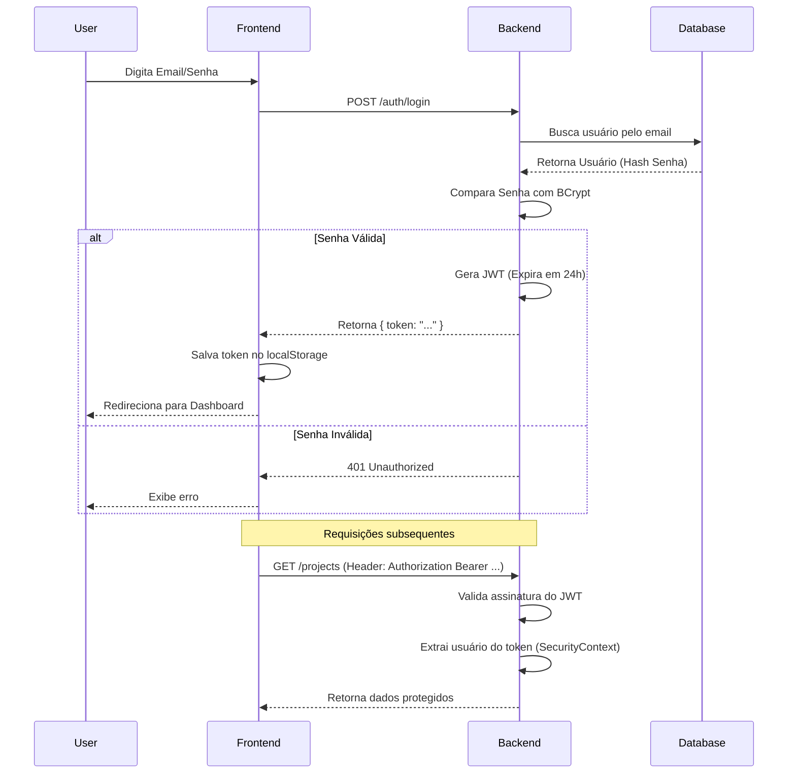

# Fluxo de Autenticação (JWT)

O ArchFlow utiliza **JSON Web Tokens (JWT)** para autenticação stateless.

## Diagrama de Sequência

## Detalhes de Implementação

1.  **Filtro de Segurança (`JwtAuthenticationFilter`):**
    *   Intercepta todas as requisições HTTP.
    *   Verifica se existe o header `Authorization`.
    *   Se o token for válido, autentica o usuário no contexto do Spring Security.

2.  **Segurança das Senhas:**
    *   As senhas nunca são salvas em texto plano.
    *   Utilizamos `BCryptPasswordEncoder` para hash.
